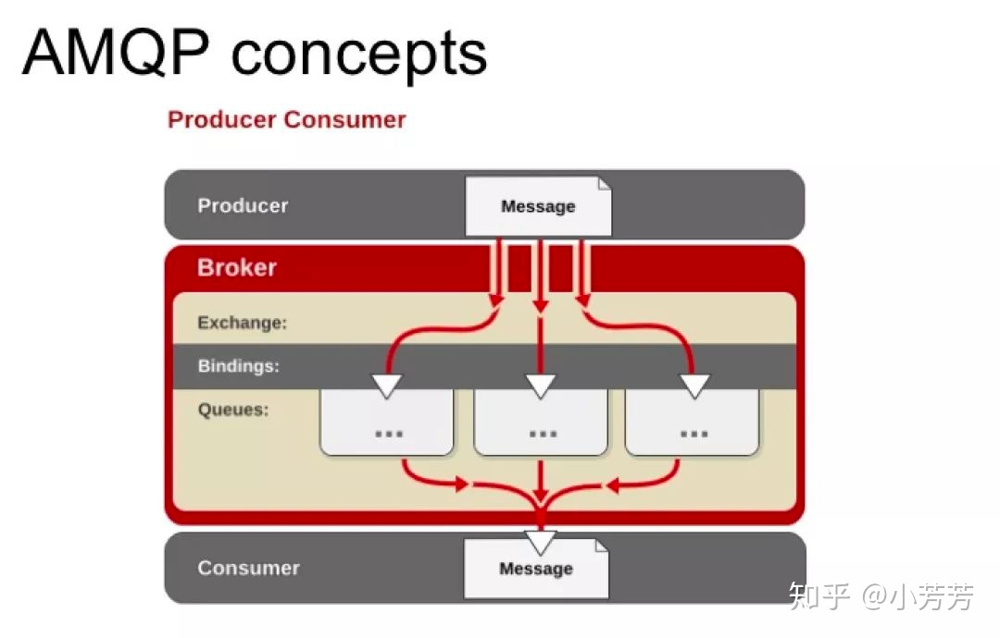

# rabbit mq


## 简介

rabbit mq是常用的消息中间件，其主要基于 `AMQP` 协议，其核心是 `Queue` `Exchange` `Binding` 为构成AMQP协议的核心。其架构组成如下图：




- Producer：消息生产者，即投递消息的程序。
- Broker：消息队列服务器实体。
  - Exchange：消息交换机，它指定消息按什么规则，路由到哪个队列。
  - Binding：绑定，它的作用就是把 Exchange 和 Queue 按照路由规则绑定起来。
  - Queue：消息队列载体，每个消息都会被投入到一个或多个队列。
- Consumer：消息消费者，即接受消息的程序。


producer、exchange、queue、consumer的关系都是多对多的，所以在进行实际代码开发时候要保证好这几个实体的对应关系；

### Exchange

Exchange接收到信息后，如何将消息转发到对应的Queue中？

根据RoutingKey和当前Exchange所绑定的Binding做匹配。若满足匹配，就向Exchange的Queue中发送消息。Exchange主要有 `Fanout`、`Direct` 和 `Topic` 三种类型。由于本次业务中主要使用了 `Direct` 类型，所以这里重点就Direct进行demo的编写和演示。


### 封装

- mq 结构体

```go
type MQ struct {
	url       string           // mq 链接的url地址
	vhost     string           // vhost 名称
	mutex     sync.RWMutex     // 读写锁
	conn      *amqp.Connection // mq链接
	consumers []*Consumer      // mq:consumer 1 : N
	closeC    chan *amqp.Error // 捕捉链接错误
	stopC     chan struct{}    // 关闭通道
	state     int              // MQ状态
}
```

该结构会对消费者和生产者进行管理，并且维护了自定义的 `stopC` 通道，用于捕捉手动正常关闭的信号；`closeC`用于捕捉异常关闭的信号；

管理同rabbitMQ的链接，并且producer和consumer基于该conn创建`channel`进行信息的生产和消费；

核心方法1: newConsumer

```go
// 通过mq获取消费者
func (m *MQ) Consumer(name string) (*Consumer, error) {
	m.mutex.Lock()
	m.mutex.Unlock()

	// 查看当前队列的状态
	if m.state != StateOpened {
		return nil, errors.New("error")
	}

	c := newConsumer(name, m)
	// 将消费者存入数组进行管理
	m.consumers = append(m.consumers, c)
	return c, nil
}

func newConsumer(name string, mq *MQ) *Consumer {
    return &Consumer{
        name:       name,
        mq:         mq,
        stopC:      make(chan struct{}),
    }
}
```


#### 背景

why？

由于旧版的消息队列没有很好的处理server断开的异常情况，server断开后会导致消费者端消费出问题，并且重链后不能继续进行消费。基于对该问题进行解决和考虑，具体处理参考： `github.com/Hurricanezwf/rabbitmq-go/mq`。


#### 主要功能

1. 封装mq、consumer结构体，并且实现相应的基本方法；
2. 实现一个consumer能够管理多个队列的方法，并且将消费者处理方法做成类似于http handler注册的形式，简化开发；
3. 实现断开重连的机制，重新链接后能够继续监听消息队列并进行处理；

## 参考

1. [rabbitmq exchange讲解](https://zhuanlan.zhihu.com/p/37198933)

